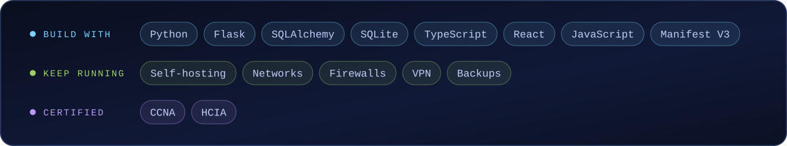

  

 

I make computers do things for humans. Mostly that means small self-hosted tools that replace a spreadsheet or a paper form, and browser extensions I wanted to exist. I run IT at an engineering firm in Lahore, which is where most of the ideas come from.

 

## Things I've built

  
  

  
  

 

## Stack

 

## Activity

<picture>
  <source media="(prefers-color-scheme: dark)" srcset="https://raw.githubusercontent.com/talalahmad34/talalahmad34/output/github-contribution-grid-snake-dark.svg" />
  <source media="(prefers-color-scheme: light)" srcset="https://raw.githubusercontent.com/talalahmad34/talalahmad34/output/github-contribution-grid-snake.svg" />
  
</picture>

